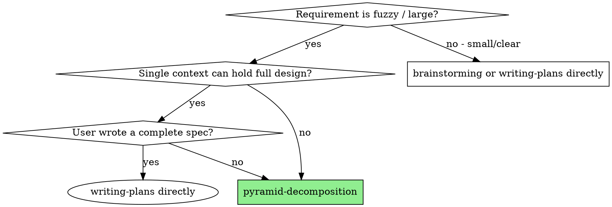

# Pyramid Memory — Milestone 2: Skills + Install Implementation Plan

> **For agentic workers:** REQUIRED SUB-SKILL: Use superpowers:subagent-driven-development (recommended) or superpowers:executing-plans to implement this plan task-by-task. Steps use checkbox (`- [ ]`) syntax for tracking.

**Goal:** Wrap the M1 `memory_cli.py` substrate into two real skills (`pyramid-decomposition`, `memory-management`) with mechanically-enforced 5 independence criteria, integrate with `brainstorming` / `subagent-driven-development` / `writing-plans`, write cross-harness install docs, and verify all user-facing acceptance criteria with eval scenarios.

**Architecture:** SKILL.md files instruct the LLM how to orchestrate calls to `memory_cli.py`. A small CLI extension (`memory check-leaf-criteria` + `--criteria-confirmed` flag on `node update`) makes the 5 criteria mechanically enforced at the storage layer. Eval scenarios live as runnable scripts under `tests/evals/` so any future agent can verify the skills still work.

**Tech Stack:** Markdown (SKILL.md, guides, install docs), Python (CLI extension + eval driver), no new runtime dependencies beyond M1.

**Spec:** `docs/superpowers/specs/2026-04-07-pyramid-memory-skill-design.md` (Milestone 2 scope: §6, §7, AC #2, #4, #7, #8)

**Prerequisite:** Milestone 1 must be tagged `m1-memory-cli` and all M1 tests passing.

---

## File Map

```
superpowers-plus/skills/
├── memory-management/
│   ├── SKILL.md                       # NEW (M2): capability summary + command reference
│   └── scripts/
│       ├── memory_cli.py              # MODIFY: add `check-leaf-criteria` + `--criteria-confirmed`
│       ├── cozo_store.py              # MODIFY: enforce criteria-confirmed gate in update_node
│       └── store.py                   # MODIFY: add criteria-check helper to Protocol + InMemoryStore
└── pyramid-decomposition/
    ├── SKILL.md                       # NEW: orchestration prompt (When/Phases 0-3)
    ├── decomposition-guide.md         # NEW: 5 criteria with positive/negative examples
    └── tests/evals/
        ├── README.md                  # how to run evals
        ├── 01_simple_blog.md          # tiny fuzzy requirement → pyramid
        ├── 02_ecommerce.md            # medium-sized
        ├── 03_data_pipeline.md        # involves dependencies
        └── run_eval.py                # runner: drives a fresh agent + checks ACs

# Existing skills modified
superpowers-plus/skills/
├── brainstorming/SKILL.md             # MODIFY: mention pyramid-decomposition for huge needs
├── subagent-driven-development/SKILL.md  # MODIFY: mention `memory context` for context loading
└── writing-plans/SKILL.md             # MODIFY: mention `memory context` before drafting

# Cross-harness install docs
superpowers-plus/docs/superpowers/
└── install-pyramid-memory.md          # NEW: per-harness install instructions
```

---

## Pre-flight: Verify M1

### Task 0: Confirm M1 is shipped and runnable

**Files:** (none)

- [ ] **Step 1: Verify M1 tag exists**

```bash
git tag -l "m1-memory-cli"
```

Expected: `m1-memory-cli` listed. If missing, stop and finish M1 first.

- [ ] **Step 2: Run M1 smoke test**

```bash
cd superpowers-plus/skills/memory-management
uv run pytest tests/test_e2e_smoke.py -v
```

Expected: PASS. If it fails, stop and fix M1.

- [ ] **Step 3: Confirm CLI is callable from a fresh shell**

```bash
unset PYTHONPATH
uv run superpowers-plus/skills/memory-management/scripts/memory_cli.py version
```

Expected: JSON `{"ok": true, "data": {"version": "0.1.0-m1"}, ...}`.

No commit needed for Task 0.

---

## Chunk 1: CLI Extensions for Mechanical Criteria Enforcement

The 5 independence criteria split into mechanical (CLI checks) vs. judgment (LLM checks):

| # | Criterion | Mechanical? |
|---|---|---|
| 1 | Single responsibility | LLM (description grammar) |
| 2 | Interface clarity | **CLI** — interface_def exists + spec length ≥ 20 |
| 3 | Independent testability | LLM (judgment) |
| 4 | Token budget | **CLI** — assemble_context().tokens_estimate ≤ 8000 |
| 5 | Closed dependencies | **CLI** — every dep is leaf/done OR has interface_def |

The CLI exposes `memory check-leaf-criteria` to report all 5 (mechanical answers + LLM-needed prompts), and the existing `node update --status leaf` is gated by `--criteria-confirmed` which fails unless mechanical checks pass.

### Task 1: Add `check_leaf_criteria` to MemoryStore Protocol + InMemoryStore

**Files:**
- Modify: `superpowers-plus/skills/memory-management/scripts/store.py`
- Modify: `superpowers-plus/skills/memory-management/tests/test_in_memory_store.py`

- [ ] **Step 1: Write the failing test**

Append to `tests/test_in_memory_store.py`:

```python
def test_check_leaf_criteria_passes_when_complete():
    s = InMemoryStore()
    s.create_node(make_node("leaf", node_type="leaf"))
    from scripts.models import Interface
    s.add_interface(Interface(
        id="i1", node_id="leaf", name="api",
        description="endpoint", spec="GET /x returns {y: int}",
        created_at="2026-04-07T00:00:00Z",
    ))
    report = s.check_leaf_criteria("demo", "leaf")
    assert report["mechanical_checks_pass"] is True
    c2 = next(c for c in report["criteria"] if c["criterion"] == "interface_clarity")
    assert c2["passes"] is True

def test_check_leaf_criteria_fails_no_interface():
    s = InMemoryStore()
    s.create_node(make_node("leaf", node_type="leaf"))
    report = s.check_leaf_criteria("demo", "leaf")
    assert report["mechanical_checks_pass"] is False
    c2 = next(c for c in report["criteria"] if c["criterion"] == "interface_clarity")
    assert c2["passes"] is False

def test_check_leaf_criteria_fails_open_dep():
    from scripts.models import Edge, Interface
    s = InMemoryStore()
    s.create_node(make_node("leaf", node_type="leaf"))
    s.create_node(make_node("dep", node_type="branch", status="draft"))  # Not leaf, no iface
    s.add_edge(Edge(kind="dependency", from_id="leaf", to_id="dep"))
    s.add_interface(Interface(
        id="i1", node_id="leaf", name="x", description="x", spec="x" * 25,
        created_at="2026-04-07T00:00:00Z",
    ))
    report = s.check_leaf_criteria("demo", "leaf")
    c5 = next(c for c in report["criteria"] if c["criterion"] == "closed_dependencies")
    assert c5["passes"] is False
    assert "dep" in c5["reason"]
```

- [ ] **Step 2: Run, expect FAIL**

```bash
uv run pytest tests/test_in_memory_store.py -k check_leaf_criteria -v
```

- [ ] **Step 3: Add `check_leaf_criteria` to the Protocol and InMemoryStore**

In `scripts/store.py`, add to `class MemoryStore(Protocol)`:

```python
    def check_leaf_criteria(self, project: str, node_id: str) -> dict: ...
```

Add to `class InMemoryStore`:

```python
    def check_leaf_criteria(self, project: str, node_id: str) -> dict:
        node = self.get_node(project, node_id)

        # Criterion 2: interface clarity
        interfaces = self.list_interfaces(project, node_id)
        c2_pass = bool(interfaces) and all(len(i.spec) >= 20 for i in interfaces)
        c2 = {
            "criterion": "interface_clarity",
            "passes": c2_pass,
            "reason": (
                f"{len(interfaces)} interface(s), all spec ≥20 chars"
                if c2_pass else
                ("no interface_def" if not interfaces else "at least one interface spec is too short (<20 chars)")
            ),
            "needs_llm_check": False,
        }

        # Criterion 4: token budget
        pkg = self.assemble_context(project, node_id)
        c4_pass = pkg.tokens_estimate <= 8000
        c4 = {
            "criterion": "token_budget",
            "passes": c4_pass,
            "reason": f"{pkg.tokens_estimate}/8000 tokens",
            "needs_llm_check": False,
        }

        # Criterion 5: closed dependencies
        deps = self.query_deps(project, node_id)
        open_deps: list[str] = []
        for d in deps:
            d_ifaces = self.list_interfaces(project, d.id)
            if d.status not in ("leaf", "done") and not d_ifaces:
                open_deps.append(d.id)
        c5_pass = len(open_deps) == 0
        c5 = {
            "criterion": "closed_dependencies",
            "passes": c5_pass,
            "reason": (
                "all deps stable (leaf/done OR have interface_def)"
                if c5_pass else
                f"unstable deps: {', '.join(open_deps)}"
            ),
            "needs_llm_check": False,
        }

        # Criteria 1, 3: LLM judgment required
        c1 = {
            "criterion": "single_responsibility",
            "passes": None,
            "needs_llm_check": True,
            "instruction": (
                f"Read this node description: {node.description!r}. "
                "Confirm it describes ONE responsibility with no 'and'/'以及'/'同时'/'plus'. "
                "If it bundles concerns, split the node first."
            ),
        }
        c3 = {
            "criterion": "independent_testability",
            "passes": None,
            "needs_llm_check": True,
            "instruction": (
                "Confirm this leaf can be tested with mocked dependencies only. "
                "If it requires instantiating sibling leaves to test, the boundary is wrong — "
                "extract the shared abstraction into a new node first."
            ),
        }

        mechanical_pass = c2["passes"] and c4["passes"] and c5["passes"]
        return {
            "node_id": node_id,
            "criteria": [c1, c2, c3, c4, c5],
            "mechanical_checks_pass": mechanical_pass,
            "ready_for_leaf_status": False,  # LLM must confirm 1+3 via --criteria-confirmed
        }
```

- [ ] **Step 4: Run, expect PASS**

```bash
uv run pytest tests/test_in_memory_store.py -k check_leaf_criteria -v
```

- [ ] **Step 5: Commit**

```bash
git add -u
git commit -m "feat(memory-cli): MemoryStore.check_leaf_criteria + InMemoryStore impl"
```

---

### Task 2: Add `check_leaf_criteria` to CozoStore

**Files:**
- Modify: `superpowers-plus/skills/memory-management/scripts/cozo_store.py`
- Modify: `superpowers-plus/skills/memory-management/tests/test_cozo_store.py`

- [ ] **Step 1: Write the failing test**

```python
def test_cozo_check_leaf_criteria_full(store):
    from scripts.models import Edge, Interface
    store.ensure_schema()
    store.create_node(make_node("leaf", node_type="leaf"))
    store.add_interface(Interface(
        id="i1", node_id="leaf", name="api", description="d",
        spec="GET /resource returns {id, name, status}",  # >20 chars
        created_at="2026-04-07T00:00:00Z",
    ))
    report = store.check_leaf_criteria("demo", "leaf")
    assert report["mechanical_checks_pass"] is True
    assert len(report["criteria"]) == 5
```

- [ ] **Step 2: Run, expect FAIL**

- [ ] **Step 3: Implement in CozoStore (same logic, calls go through self.* methods)**

```python
    def check_leaf_criteria(self, project: str, node_id: str) -> dict:
        # Identical structural logic to InMemoryStore — delegated through self.* graph queries.
        node = self.get_node(project, node_id)
        interfaces = self.list_interfaces(project, node_id)
        c2_pass = bool(interfaces) and all(len(i.spec) >= 20 for i in interfaces)
        c2 = {
            "criterion": "interface_clarity",
            "passes": c2_pass,
            "reason": (
                f"{len(interfaces)} interface(s), all spec ≥20 chars"
                if c2_pass else
                ("no interface_def" if not interfaces else "at least one interface spec is too short (<20 chars)")
            ),
            "needs_llm_check": False,
        }
        pkg = self.assemble_context(project, node_id)
        c4_pass = pkg.tokens_estimate <= 8000
        c4 = {
            "criterion": "token_budget",
            "passes": c4_pass,
            "reason": f"{pkg.tokens_estimate}/8000 tokens",
            "needs_llm_check": False,
        }
        deps = self.query_deps(project, node_id)
        open_deps: list[str] = []
        for d in deps:
            d_ifaces = self.list_interfaces(project, d.id)
            if d.status not in ("leaf", "done") and not d_ifaces:
                open_deps.append(d.id)
        c5_pass = len(open_deps) == 0
        c5 = {
            "criterion": "closed_dependencies",
            "passes": c5_pass,
            "reason": (
                "all deps stable (leaf/done OR have interface_def)"
                if c5_pass else
                f"unstable deps: {', '.join(open_deps)}"
            ),
            "needs_llm_check": False,
        }
        c1 = {
            "criterion": "single_responsibility",
            "passes": None,
            "needs_llm_check": True,
            "instruction": (
                f"Read this node description: {node.description!r}. "
                "Confirm it describes ONE responsibility with no 'and'/'以及'/'同时'/'plus'."
            ),
        }
        c3 = {
            "criterion": "independent_testability",
            "passes": None,
            "needs_llm_check": True,
            "instruction": (
                "Confirm this leaf can be tested with mocked dependencies only."
            ),
        }
        return {
            "node_id": node_id,
            "criteria": [c1, c2, c3, c4, c5],
            "mechanical_checks_pass": c2["passes"] and c4["passes"] and c5["passes"],
            "ready_for_leaf_status": False,
        }
```

- [ ] **Step 4: Run, expect PASS**

- [ ] **Step 5: Commit**

```bash
git add -u
git commit -m "feat(memory-cli): CozoStore.check_leaf_criteria"
```

---

### Task 3: Gate `node update --status leaf` on `--criteria-confirmed`

This is the **mechanical enforcement** of AC #7. Without `--criteria-confirmed`, transitioning to status=leaf is rejected. With the flag, mechanical checks run; if they fail, the update is rejected.

**Files:**
- Modify: `superpowers-plus/skills/memory-management/scripts/memory_cli.py`
- Modify: `superpowers-plus/skills/memory-management/tests/test_cli_node.py`

- [ ] **Step 1: Write the failing test**

Append to `tests/test_cli_node.py`:

```python
def test_node_update_to_leaf_requires_criteria_flag(initialized):
    initialized("node", "create", "--id", "n1", "--name", "x", "--type", "leaf",
                "--level", "1", "--description", "x", "--origin", "user_stated")
    # Without --criteria-confirmed: must fail
    r = initialized("node", "update", "--id", "n1", "--status", "leaf")
    payload = json.loads(r.stdout)
    assert payload["ok"] is False
    assert payload["error"]["code"] == "criteria_not_confirmed"

def test_node_update_to_leaf_rejects_when_mechanical_fails(initialized):
    initialized("node", "create", "--id", "n1", "--name", "x", "--type", "leaf",
                "--level", "1", "--description", "x", "--origin", "user_stated")
    # No interface yet → criterion 2 fails
    r = initialized("node", "update", "--id", "n1", "--status", "leaf", "--criteria-confirmed")
    payload = json.loads(r.stdout)
    assert payload["ok"] is False
    assert payload["error"]["code"] == "criteria_failed"
    assert "interface" in payload["error"]["message"].lower()

def test_node_update_to_leaf_passes_when_complete(initialized):
    initialized("node", "create", "--id", "n1", "--name", "x", "--type", "leaf",
                "--level", "1", "--description", "x", "--origin", "user_stated")
    initialized("interface", "add", "--id", "i1", "--node", "n1",
                "--name", "api", "--description", "d",
                "--spec", "GET /x returns {field: type}")  # >20 chars
    r = initialized("node", "update", "--id", "n1", "--status", "leaf", "--criteria-confirmed")
    payload = json.loads(r.stdout)
    assert payload["ok"] is True
    assert payload["data"]["status"] == "leaf"
```

- [ ] **Step 2: Run, expect FAIL**

- [ ] **Step 3: Modify `node_update` and add `memory check-leaf-criteria` command**

In `memory_cli.py`, replace the `node_update` definition:

```python
@node.command("update")
@click.option("--id", "node_id", required=True)
@click.option("--status")
@click.option("--description")
@click.option("--tokens-estimate", type=int)
@click.option("--criteria-confirmed", is_flag=True,
              help="Required when transitioning to status=leaf; runs mechanical checks.")
@click.option("--project")
def node_update(node_id, status, description, tokens_estimate, criteria_confirmed, project):
    s, cfg = _store()
    p = _project(project, cfg)

    # Gate: transitioning to leaf requires criteria confirmation
    if status == "leaf":
        if not criteria_confirmed:
            emit_error(
                "transitioning to status=leaf requires --criteria-confirmed "
                "(run `memory check-leaf-criteria --node X` first, then re-invoke with the flag)",
                code="criteria_not_confirmed",
            )
        report = s.check_leaf_criteria(p, node_id)
        if not report["mechanical_checks_pass"]:
            failed = [c for c in report["criteria"] if c.get("passes") is False]
            messages = "; ".join(f"{c['criterion']}: {c['reason']}" for c in failed)
            emit_error(
                f"mechanical leaf criteria failed: {messages}",
                code="criteria_failed",
            )

    fields = {}
    if status is not None:
        fields["status"] = status
    if description is not None:
        fields["description"] = description
    if tokens_estimate is not None:
        fields["tokens_estimate"] = tokens_estimate
    fields["updated_at"] = _now()
    n = s.update_node(p, node_id, **fields)
    emit(n.to_dict())
```

Add to the `memory` group:

```python
@memory.command("check-leaf-criteria")
@click.option("--node", "node_id", required=True)
@click.option("--project")
def memory_check_leaf_criteria(node_id, project):
    """Report all 5 independence criteria for a node (mechanical answers + LLM prompts)."""
    s, cfg = _store()
    p = _project(project, cfg)
    report = s.check_leaf_criteria(p, node_id)
    emit(report, ok=report["mechanical_checks_pass"])
```

- [ ] **Step 4: Run, expect PASS**

```bash
uv run pytest tests/test_cli_node.py -v
```

- [ ] **Step 5: Add a CLI test for `check-leaf-criteria` directly**

Create `tests/test_cli_check_criteria.py`:

```python
import json
import pytest

@pytest.fixture
def initialized(run_cli):
    run_cli("init", "--project", "demo", "--embedding", "skip", "--non-interactive")
    return run_cli

def test_check_leaf_criteria_returns_all_5(initialized):
    initialized("node", "create", "--id", "n1", "--name", "x", "--type", "leaf",
                "--level", "1", "--description", "x", "--origin", "user_stated")
    r = initialized("memory", "check-leaf-criteria", "--node", "n1")
    payload = json.loads(r.stdout)
    assert len(payload["data"]["criteria"]) == 5
    names = {c["criterion"] for c in payload["data"]["criteria"]}
    assert names == {
        "single_responsibility", "interface_clarity", "independent_testability",
        "token_budget", "closed_dependencies",
    }
```

- [ ] **Step 6: Run, expect PASS**

```bash
uv run pytest tests/test_cli_check_criteria.py -v
```

- [ ] **Step 7: Commit**

```bash
git add -u
git commit -m "feat(memory-cli): mechanical 5-criteria enforcement on leaf transitions"
```

---

## Chunk 2: Decomposition Guide

### Task 4: Write `decomposition-guide.md` with the 5 criteria + examples

**Files:**
- Create: `superpowers-plus/skills/pyramid-decomposition/decomposition-guide.md`

- [ ] **Step 1: Create the directory**

```bash
mkdir -p superpowers-plus/skills/pyramid-decomposition
```

- [ ] **Step 2: Write the guide**

```markdown
# Decomposition Guide: The 5 Independence Criteria

This is the reference document for the `pyramid-decomposition` skill. Every leaf node in a pyramid must satisfy **all five** criteria. Failing any one forces the LLM to split the node further or restructure the pyramid.

The CLI mechanically checks criteria 2, 4, and 5. Criteria 1 and 3 require LLM judgment and are documented here so the agent knows what to look for.

---

## Criterion 1: Single Responsibility (LLM check)

**Rule:** The leaf description must describe exactly one responsibility, expressible in a single sentence with no conjunctions ("and", "也", "以及", "同时", "plus", "while also").

### Why
Bundled responsibilities lead to subagents that touch multiple concerns and produce code that's hard to test, hard to review, and tightly coupled to siblings.

### How to check
Read the node's `description` field aloud. If you naturally pause at "and" or "and then", you have two responsibilities. Split.

### Examples

**❌ Fails (bundled):**
> "Implement user signup endpoint **and** send welcome email **and** track analytics event"

**✅ Passes (single responsibility):**
> "Implement user signup endpoint that creates a row in `users` and returns the new user's id"

The "send email" and "track analytics" become sibling leaves with their own interfaces. They listen on a `user.created` event from the signup endpoint.

**❌ Fails (hidden conjunction):**
> "Render the dashboard **with** filtering, sorting, **and** export"

**✅ Passes:**
> "Render the dashboard skeleton (header, body grid container, no data interactions)"

Filtering, sorting, export are three more leaves under a `dashboard` branch.

---

## Criterion 2: Interface Clarity (CLI-checked)

**Rule:** The node has at least one `interface_def` record, and every interface's `spec` field is at least 20 characters of meaningful content (signature, schema, or contract fragment).

### Why
A leaf without a stated interface has hidden coupling — the implementer will improvise inputs and outputs, sibling leaves will collide, and integration becomes a guessing game.

### How to check
The CLI does this. If `memory check-leaf-criteria --node X` reports `interface_clarity: false`, run `memory interface add --node X` first. Examples of acceptable specs:

**Function signature:**
```
addItem(cart_id: str, sku: str, qty: int) -> {cart_id: str, total: float}
```

**HTTP endpoint:**
```
POST /api/v1/cart/items {sku, qty} -> 201 {cart_id, total} | 404 {error}
```

**Event contract:**
```
emits "user.created" {user_id, email, created_at} on auth_db.users insert
```

**❌ Fails (too vague):**
```
spec: "the cart API"  // 12 chars, no contract
```

---

## Criterion 3: Independent Testability (LLM check)

**Rule:** The leaf must be testable with mocked dependencies only. The implementer should never need to instantiate sibling leaves to write its tests.

### Why
If sibling instantiation is required, the boundary is wrong. The shared piece needs to be lifted into its own node so both leaves depend on it explicitly.

### How to check
Mentally write the first three test cases for the leaf. Ask:
- Do I need real instances of sibling leaves? → Boundary wrong; refactor.
- Do I need real database/network/filesystem? → Acceptable if it's a true external dep documented as such.
- Does setting up the test require >5 lines of fixture code? → Probably bundled responsibilities (criterion 1).

### Example

**❌ Fails:**
> Leaf "render checkout form" requires a real `Cart` instance to test.

**Refactor:**
- Lift `Cart` into its own dependency leaf with a clear interface.
- "Render checkout form" now depends on `Cart` via mock; testable in isolation.

---

## Criterion 4: Token Budget (CLI-checked)

**Rule:** The assembled context package (`memory context --node X`) must fit within 8000 input tokens.

### Why
A subagent with >8k tokens of context starts losing precision. The whole point of the pyramid is to keep each leaf's working set small enough that a fresh subagent can hold it entirely.

### How to check
The CLI computes this by character-count heuristic (`chars / 4`). Run:
```bash
memory check-leaf-criteria --node X
```
The `token_budget` criterion will report `passes: true/false` with the current count.

### If you fail
- Trim the leaf's `description` to one sentence.
- Move historical decisions that no longer matter to the parent branch (they remain accessible via `query ancestors`).
- Split the leaf if the description is doing too much.

The 8000 limit is a soft default; you can override per-skill in M3 if needed.

---

## Criterion 5: Closed Dependencies (CLI-checked)

**Rule:** Every dependency listed via `edge add --kind dependency` must point to a node that is **either**:
- Already at status `leaf` or `done` (i.e., its interface is fixed), **or**
- A node with at least one `interface_def` record (i.e., its contract is published even if not yet implemented).

### Why
If a leaf depends on something that's still mutable, the leaf's implementation is built on sand. The dependency might rename a method, change a return type, or get re-decomposed — invalidating the leaf.

### How to check
The CLI does this. The error message will list which dependency IDs are unstable.

### If you fail
- For each unstable dep listed, either:
  - Decompose it first (recursive Phase 1 on the dep)
  - Or freeze its interface now: `memory interface add --node <dep_id>` even if implementation isn't done
- Then re-run the criteria check on the original leaf.

**Common pattern:** When you discover an unstable dep mid-decomposition, push the original leaf back to status `draft`, recurse into the dep until it has an interface, then return.

---

## Quick Reference Card

| # | Criterion | Check | Failure → Action |
|---|---|---|---|
| 1 | Single responsibility | LLM reads description | Split into sibling leaves |
| 2 | Interface clarity | CLI: has interface_def, spec ≥20 chars | Run `interface add` |
| 3 | Independent testability | LLM mental test-write | Lift shared piece into own node |
| 4 | Token budget | CLI: tokens ≤ 8000 | Trim description or split |
| 5 | Closed dependencies | CLI: deps are leaf/done OR have interface | Decompose dep or publish its interface |

When all 5 pass, mark the node as leaf:
```bash
memory_cli.py node update --id <X> --status leaf --criteria-confirmed
```
The `--criteria-confirmed` flag tells the CLI you've also done the LLM checks (1 and 3).
```

- [ ] **Step 3: Commit**

```bash
git add superpowers-plus/skills/pyramid-decomposition/decomposition-guide.md
git commit -m "docs(pyramid): decomposition guide with 5 independence criteria + examples"
```

---

## Chunk 3: memory-management SKILL.md

### Task 5: Write `memory-management/SKILL.md`

**Files:**
- Create: `superpowers-plus/skills/memory-management/SKILL.md`

- [ ] **Step 1: Write the SKILL.md**

```markdown
---
name: memory-management
description: Use when storing or recalling pyramid decomposition state — nodes, decisions, interfaces, dependencies — across sessions or when preparing context packages for subagents
---

# Memory Management

Persistent graph + decision storage for AI-driven decomposition. Backed by an embedded CozoDB at `~/.pyramid-memory/`. Invoked via the `memory_cli.py` Python CLI inside this skill's `scripts/` directory.

## When to Use

**This skill is invoked by other skills more than directly by users.** Trigger it when:

- `pyramid-decomposition` needs to store/retrieve nodes, decisions, interfaces, or compute leaf criteria
- `subagent-driven-development` needs to assemble the context package for a leaf before dispatching its implementer subagent
- `writing-plans` needs the decision history and interfaces for a leaf before drafting its plan
- `brainstorming` wants to recall historical decisions before proposing new approaches
- The user asks "what did we decide about X" or "show me the pyramid for Y"

## Prerequisites

This skill requires:
1. `uv` installed on the user's machine. If missing, instruct: `curl -LsSf https://astral.sh/uv/install.sh | sh`
2. The memory store initialized once with `memory_cli.py init`. If `memory config show` reports `initialized: false`, instruct the user to run init.

## Core Workflow

### Step 1 — Capability check (once per session)

Before issuing any other command, run:
```bash
uv run skills/memory-management/scripts/memory_cli.py config show
```

Read the JSON. Use it to decide whether semantic recall is available (`embedding_provider != "skip"`). **Do not re-probe per call** — the answer is stable for the session.

### Step 2 — Choose the right command

| Goal | Command |
|---|---|
| Store a new node | `node create --id X --name N --type T --level L --description D --origin user_stated\|skill_inferred` |
| Update node status | `node update --id X --status S` (use `--criteria-confirmed` for status=leaf) |
| Add hierarchy edge | `edge add --kind hierarchy --from P --to C [--order N]` |
| Add dependency edge | `edge add --kind dependency --from F --to T` |
| Walk children | `query children --id X` |
| Walk ancestors | `query ancestors --id X` |
| Walk subtree | `query subtree --root X` |
| List dependencies | `query deps --id X` |
| Detect cycles | `query cycles` |
| Store a decision | `decision store --id D --node N --question Q --options '[]' --chosen C --reasoning R` |
| Add an interface | `interface add --id I --node N --name Name --description D --spec S` |
| Recall (BM25 default) | `memory recall --query "..."` |
| Recall (semantic, if available) | `memory recall --query "..." --semantic` |
| Get full implementation package | `memory context --node <leaf-id>` |
| Check 5 criteria | `memory check-leaf-criteria --node X` |
| Validate whole project | `memory validate` |
| Get statistics | `memory stats` |
| Health check | `memory doctor` |
| Export project | `memory export` |

### Step 3 — Read the JSON output contract

Every command returns:
```json
{
  "ok": true,
  "data": { ... },
  "warnings": [...],
  "degraded": false
}
```

- `ok: false` + `error: {code, message}` → handle the error or surface it
- `degraded: true` → a fallback was used (e.g., embedding unavailable, fell back to BM25). Decide whether to inform the user; the result is still usable.
- `warnings: [...]` → non-blocking notes

## Integration Pattern: Assembling Context for a Subagent

When `subagent-driven-development` is about to dispatch a subagent for leaf node `X`:

```bash
uv run skills/memory-management/scripts/memory_cli.py memory context --node X
```

The returned package contains:
- `node` — the leaf itself
- `ancestors` — the chain up to L0
- `decisions` — every decision attached to the leaf or its ancestors
- `interfaces` — interfaces of the leaf AND of its dependencies
- `deps` — dependency nodes
- `tokens_estimate` — current size

Pass this directly into the subagent's prompt as the "context" section. The subagent does NOT need to read project files outside of what the package + its dep interfaces describe.

## Failure Modes

If `memory_cli.py` returns `degraded: true` or `ok: false`:

1. **`uninitialized` error** → instruct user to run `memory_cli.py init`
2. **`missing_project` error** → either pass `--project X` explicitly or run `init` to set a default
3. **`criteria_not_confirmed` error** → caller forgot to run `check-leaf-criteria` and pass `--criteria-confirmed`; this is the gate enforcing AC #7
4. **`criteria_failed` error** → mechanical checks failed; the message lists which; fix and retry
5. **`degraded: true` on recall** → semantic search was unavailable; results are BM25; usually fine, surface only if results look weak
6. **DB corruption** → run `memory doctor`, then `memory doctor --repair` if available, else `memory export` to a backup before any destructive recovery

## What This Skill Does NOT Do

- It does not decompose requirements (that's `pyramid-decomposition`)
- It does not implement leaf code (that's `subagent-driven-development`)
- It does not do code-level context (use Serena or LSP-based tools)
- It does not manage project files — only the decision/decomposition graph in `~/.pyramid-memory/`
```

- [ ] **Step 2: Commit**

```bash
git add superpowers-plus/skills/memory-management/SKILL.md
git commit -m "feat(skill): memory-management SKILL.md (capability + command reference)"
```

---

## Chunk 4: pyramid-decomposition SKILL.md

### Task 6: Write `pyramid-decomposition/SKILL.md` first draft

**Files:**
- Create: `superpowers-plus/skills/pyramid-decomposition/SKILL.md`

- [ ] **Step 1: Write the SKILL.md**

```markdown
---
name: pyramid-decomposition
description: Use when the user proposes a fuzzy large-scale requirement that won't fit a single context window — recursively decompose into a confirmed pyramid with mechanically-enforced 5 independence criteria
---

# Pyramid Decomposition

Recursively chunk fuzzy requirements into a tree of independently-implementable leaves. Each leaf passes 5 mechanical+judgment checks. Each split is justified by a stored decision. The user never has to write a spec — they answer micro-questions and the pyramid emerges.

**Why this skill exists:** AI agents hit a wall on large engineering projects because (1) the context window can't hold the whole design, (2) users can't articulate fuzzy requirements upfront, and (3) without a forcing function, decompositions stop too early and leaves coupling stays hidden.

## When to Use



**Trigger phrases (the user said):**
- "做一个 XX 系统" / "build a system that..."
- "重构 XX 模块" / "refactor X to..."
- "我也不知道具体怎么做" / "I'm not sure how to structure this"
- "先帮我拆解一下" / "help me break this down"

**Don't use for:**
- Tightly-scoped bug fixes (use `debugging` or direct edits)
- Single-file features (use `writing-plans` directly)
- Pure research questions (use `brainstorming`)

## Prerequisites

1. The `memory-management` skill is available (its CLI is at `skills/memory-management/scripts/memory_cli.py`)
2. `uv` is installed (the CLI uses PEP 723)
3. `memory config show` reports `initialized: true`. If not, run `memory_cli.py init --project <name>` once.

## The 5 Independence Criteria

Every leaf must pass these. See `decomposition-guide.md` (next to this file) for the full reference.

| # | Criterion | Checked by |
|---|---|---|
| 1 | Single responsibility | You (LLM) reading the description |
| 2 | Interface clarity | CLI (`check-leaf-criteria`) |
| 3 | Independent testability | You (LLM) mentally writing tests |
| 4 | Token budget (≤8000) | CLI |
| 5 | Closed dependencies | CLI |

The CLI **mechanically rejects** `node update --status leaf` unless 2, 4, 5 pass AND you pass `--criteria-confirmed` (signaling you've checked 1 and 3).

## Workflow

### Phase 0 — Initialize

1. Run `memory config show`. If `initialized: false`, ask the user for a project name and run:
   ```bash
   uv run skills/memory-management/scripts/memory_cli.py init --project <name>
   ```
2. Cache the embedding capability for the session: `data.embedding_provider != "skip"` → semantic recall available.
3. Take the user's raw requirement (often 1-3 sentences). Create the L0 root:
   ```bash
   uv run .../memory_cli.py node create \
     --id root \
     --name "<short title>" \
     --type root \
     --level 0 \
     --description "<the full raw requirement, verbatim>" \
     --origin user_stated
   ```

### Phase 1 — Recursive Decomposition

For the current node `N` (start with `root`):

#### 1.1 Decide: branch or leaf?

Ask yourself: can `N` be implemented in one focused subagent task? If yes, jump to **1.5 (mark as leaf)**. If no, continue.

#### 1.2 Recall historical patterns

```bash
uv run .../memory_cli.py memory recall --query "<N's description>" --k 5
```
If `data.matches` contains relevant historical nodes from prior sessions, read their decisions:
```bash
uv run .../memory_cli.py decision list --node <matched-id>
```
Use these to inform — but not dictate — your proposed split.

#### 1.3 Propose 3-5 children

This is YOUR reasoning step (no CLI). Read `N.description`. Identify the natural axes of decomposition (typically: layers, capabilities, lifecycle stages, or external boundaries). Propose 3-5 child nodes. **Tag each as `user_stated` if the concept appeared in the user's original requirement, or `skill_inferred` if you surfaced it.** This tagging is essential for AC #6.

#### 1.4 Confirm with the user (interactive micro-questions)

For each proposed child, ask the user a focused question. Examples:
- "I'm splitting `N` into A, B, C. A handles X, B handles Y, C handles Z. Did I miss anything?"
- "For `B`, do you care about [specific concern]? If yes, that's a sub-leaf; if no, we cut it."
- "Between B and C — does the order matter? If B must come before C, that's a dependency edge."

The user's answers either confirm the split, reveal more sub-children, or push back on a node. Iterate until the user confirms the children list.

For each accepted child:
```bash
# 1. Create the node
uv run .../memory_cli.py node create \
  --id <child-id> \
  --name "<child name>" \
  --type branch \
  --level <N.level + 1> \
  --description "<one-sentence description>" \
  --origin <user_stated|skill_inferred>

# 2. Connect to parent
uv run .../memory_cli.py edge add --kind hierarchy --from <N.id> --to <child-id> --order <position>
```

For the split itself, store a decision on `N`:
```bash
uv run .../memory_cli.py decision store \
  --id "d-split-<N.id>" \
  --node <N.id> \
  --question "How to decompose <N.name>?" \
  --options '["A+B+C", "alternative-1", "alternative-2"]' \
  --chosen "A+B+C" \
  --reasoning "<why these axes — user's words preferred>" \
  --tradeoffs "<what we gave up>"
```

This decision is mandatory: AC #5 requires every branch node to have ≥1 decision.

Recurse into each child (back to **1.1**).

#### 1.5 Mark as leaf

When you reach a node `L` that you believe is implementable in one subagent task:

a. **Capture the interface** (criterion 2 — required):
```bash
uv run .../memory_cli.py interface add \
  --id "iface-<L.id>" \
  --node <L.id> \
  --name "<interface name>" \
  --description "<what it exposes>" \
  --spec "<function signature OR HTTP endpoint OR event contract — at least 20 chars>"
```
If `L` exposes multiple things, add multiple interfaces.

b. **Run the criteria check:**
```bash
uv run .../memory_cli.py memory check-leaf-criteria --node <L.id>
```
Read the JSON. The mechanical checks (criteria 2, 4, 5) will report pass/fail with reasons. Criteria 1 and 3 will be marked `needs_llm_check: true` with prompts.

c. **Do the LLM checks (criteria 1 and 3):**
- **Criterion 1 (single responsibility):** Read `L.description`. Does it contain "and" / "也" / "以及" / "同时"? If yes, split.
- **Criterion 3 (testability):** Mentally write 3 test cases. Do they require instantiating sibling leaves? If yes, lift the shared piece into a new node.

d. **If everything passes:**
```bash
uv run .../memory_cli.py node update \
  --id <L.id> \
  --status leaf \
  --criteria-confirmed
```
The CLI re-runs mechanical checks at this moment and rejects if anything regressed. The `--criteria-confirmed` flag is your signature that you also did 1 and 3.

e. **If anything fails:** treat the node as a branch and recurse (back to **1.3**).

### Phase 2 — Dependency Pass

Once all leaves are marked, walk through them and identify cross-branch dependencies. For each:

```bash
uv run .../memory_cli.py edge add --kind dependency --from <leaf-A> --to <leaf-B>
```

Then check for cycles:
```bash
uv run .../memory_cli.py query cycles
```
If `data.cycles` is non-empty, fix them by either:
- Removing the weakest edge (reverse the dependency direction)
- Lifting the cycle's shared piece into a new node both depend on

### Phase 3 — Validate and Hand Off

#### 3.1 Whole-pyramid validation

```bash
uv run .../memory_cli.py memory validate
uv run .../memory_cli.py memory stats
```

Expected:
- `validate.passed: true` — every branch has ≥1 decision, every leaf has ≥1 interface
- `stats.skill_inferred_node_ratio ≥ 0.3` — at least 30% of nodes were surfaced through clarification (AC #6). If lower, you didn't ask enough questions; consider revisiting.

If either fails, fix before proceeding.

#### 3.2 Export the pyramid for the user

```bash
uv run .../memory_cli.py query subtree --root root
```
Show the user a tree view (you format it) and confirm: "This is the pyramid we built. Ready to implement?"

#### 3.3 Hand off to subagent-driven-development

For each leaf in topological order (use `query deps` to determine order):

1. Get the implementation package:
   ```bash
   uv run .../memory_cli.py memory context --node <leaf-id>
   ```
2. Pass the JSON package as the `context` section of a subagent dispatch via the `subagent-driven-development` skill.
3. Do NOT pass the entire pyramid — only the leaf's package. This preserves AC #1 (no context overflow) and AC #8 (zero shared mutable state).

After all leaves are implemented:
```bash
uv run .../memory_cli.py node update --id <leaf-id> --status done  # for each completed leaf
```

## Common Pitfalls

| Pitfall | Fix |
|---|---|
| Stopping decomposition too early | If you can't write a one-sentence description without "and", split. |
| Inventing interfaces the user didn't approve | Ask the user first; don't guess at API shape. |
| Skipping the decision store | Every branch split MUST have a decision; otherwise `memory validate` fails. |
| Not tagging origin | Without `--origin skill_inferred`, AC #6 will report 0% and the spec verification fails. |
| Loading the whole pyramid into your context | Use targeted `query` commands; never `query subtree` mid-decomposition. |
| Skipping the dependency pass | Cycles block hand-off; cross-branch deps that aren't edges become silent coupling. |

## Output to User (at the end)

Tell the user:

> "Pyramid built. **N** leaves total, **M** branches, **K** decisions stored. Skill-inferred ratio: **X%**. All 5 independence criteria pass on every leaf. Ready to hand off to `subagent-driven-development` for implementation."

Then offer to start implementation, or pause for the user to review the pyramid first.
```

- [ ] **Step 2: Commit**

```bash
git add superpowers-plus/skills/pyramid-decomposition/SKILL.md
git commit -m "feat(skill): pyramid-decomposition SKILL.md first draft (Phases 0-3)"
```

---

### Task 7: Skill self-test by reading both files end-to-end

This is a "tests" cycle for SKILL.md content — there's no unit test for prose, but there's a structural review.

**Files:** (none modified unless issues found)

- [ ] **Step 1: Read both SKILL.md files in sequence as if you were a fresh agent**

```bash
cat superpowers-plus/skills/pyramid-decomposition/SKILL.md
cat superpowers-plus/skills/memory-management/SKILL.md
```

For each file, ask:
1. Could a fresh agent execute every command in the workflow without going outside this file?
2. Are all `memory_cli.py` commands referenced actually defined in M1/M2 plans?
3. Does the workflow handle the `degraded: true` and error cases?
4. Are the 5 criteria explained somewhere? (Should be `decomposition-guide.md`.)
5. Does Phase 3 actually hand off cleanly to `subagent-driven-development`?

- [ ] **Step 2: Cross-reference all commands against the CLI source**

```bash
grep -E "uv run.*memory_cli.py" superpowers-plus/skills/pyramid-decomposition/SKILL.md superpowers-plus/skills/memory-management/SKILL.md | sort -u
```

For each command in the output, verify it exists in `memory_cli.py`:

```bash
grep -E "^@.*\.command|^@cli\.command" superpowers-plus/skills/memory-management/scripts/memory_cli.py
```

If the SKILL.md references a command that doesn't exist, EITHER add the command (extend M2 with a new task) OR fix the SKILL.md.

- [ ] **Step 3: If issues found, fix in place**

Use the `Edit` tool to patch SKILL.md(s). Do not create new files. Aim for minimal, surgical edits.

- [ ] **Step 4: Commit any fixes**

```bash
git add -u
git commit -m "fix(skill): SKILL.md self-review fixes from Task 7" || echo "no fixes needed"
```

---

## Chunk 5: Integration with Existing Skills

### Task 8: Update `brainstorming` SKILL.md to mention pyramid-decomposition

**Files:**
- Modify: `superpowers-plus/skills/brainstorming/SKILL.md`

- [ ] **Step 1: Read the current "When to Use" section**

```bash
grep -n "When to Use\|brainstorming\|pyramid" superpowers-plus/skills/brainstorming/SKILL.md | head -30
```

- [ ] **Step 2: Insert a small "Escalation" note after the When to Use section**

Use the `Edit` tool to add (after the existing When section):

```markdown
## Escalation: When the Requirement Is Too Big

If the user's requirement won't fit a single context window — typically: multiple subsystems, fuzzy structure, you'd need to read >5 files just to scope it — switch to `pyramid-decomposition` instead. That skill produces a memoized pyramid that this skill cannot, and it hands back here for individual leaf brainstorms.

**Trigger:** "build a system", "refactor the whole X", or any time you find yourself wanting to ask >10 clarifying questions in a single brainstorm.
```

- [ ] **Step 3: Commit**

```bash
git add superpowers-plus/skills/brainstorming/SKILL.md
git commit -m "docs(brainstorming): point at pyramid-decomposition for oversized requirements"
```

---

### Task 9: Update `subagent-driven-development` SKILL.md to use `memory context`

**Files:**
- Modify: `superpowers-plus/skills/subagent-driven-development/SKILL.md`

- [ ] **Step 1: Read the current dispatch section**

```bash
grep -n "context\|prompt\|dispatch" superpowers-plus/skills/subagent-driven-development/SKILL.md | head -30
```

- [ ] **Step 2: Insert a "Context Loading from Pyramid Memory" note**

Use the `Edit` tool to add (in the per-task dispatch section):

```markdown
## Context Loading from Pyramid Memory (when applicable)

If this implementation plan was produced by `pyramid-decomposition`, every task corresponds to a leaf node in `~/.pyramid-memory/`. Before dispatching the implementer subagent, fetch the leaf's full context package:

```bash
uv run skills/memory-management/scripts/memory_cli.py memory context --node <leaf-id>
```

The returned JSON contains everything the subagent needs:
- The leaf description
- All ancestor decisions (the "why" of the decomposition)
- The leaf's interfaces (what it must expose)
- Dependency interfaces (what it can call)
- Token estimate

Pass this JSON verbatim into the subagent's prompt as the `## Context` section. **Do not pass the entire pyramid** — only this one package. This is what keeps each subagent's working set bounded.

After the leaf is implemented, mark it done:
```bash
uv run skills/memory-management/scripts/memory_cli.py node update --id <leaf-id> --status done
```
```

- [ ] **Step 3: Commit**

```bash
git add superpowers-plus/skills/subagent-driven-development/SKILL.md
git commit -m "docs(subagent-driven): use memory context for leaf packages from pyramid memory"
```

---

### Task 10: Update `writing-plans` SKILL.md to consult `memory context`

**Files:**
- Modify: `superpowers-plus/skills/writing-plans/SKILL.md`

- [ ] **Step 1: Add a "Context from Pyramid Memory" section**

Use the `Edit` tool to add (after the existing Scope Check section):

```markdown
## Context from Pyramid Memory (when applicable)

If this plan is being written for a leaf node from `pyramid-decomposition`, fetch its context package first:

```bash
uv run skills/memory-management/scripts/memory_cli.py memory context --node <leaf-id>
```

Use the returned `decisions` to inform task ordering, the `interfaces` to define API shapes in tasks, and the `deps` to know what's already implemented vs. what your tasks must build. The plan you write should NOT re-derive any of this — it's authoritative source.
```

- [ ] **Step 2: Commit**

```bash
git add superpowers-plus/skills/writing-plans/SKILL.md
git commit -m "docs(writing-plans): consult memory context when planning a leaf"
```

---

## Chunk 6: Cross-Harness Install Documentation

### Task 11: Write `install-pyramid-memory.md`

**Files:**
- Create: `superpowers-plus/docs/superpowers/install-pyramid-memory.md`

- [ ] **Step 1: Write the install guide**

```markdown
# Pyramid Memory Skills — Installation Guide

These two skills (`pyramid-decomposition` + `memory-management`) live inside the `superpowers-plus` plugin. Once you have `superpowers-plus` installed for your harness, the only extra step is installing `uv` and running the one-time `init`.

## Hard Dependency: `uv`

The skills' Python CLI uses [PEP 723 inline script metadata](https://peps.python.org/pep-0723/), which requires `uv` to manage isolated dependency caches.

```bash
curl -LsSf https://astral.sh/uv/install.sh | sh
```

Verify:
```bash
uv --version
```

Without `uv`, the skills will fail with a clear error message asking you to install it.

## One-Time Initialization

After installing `superpowers-plus` for your harness, run (once):

```bash
uv run ~/.<harness>/skills/superpowers-plus/skills/memory-management/scripts/memory_cli.py init --project <your-project>
```

This creates `~/.pyramid-memory/` with `config.toml` and an empty CozoDB store. You're done — both skills are now usable.

## Per-Harness Notes

### Claude Code
Skills auto-discovered from `~/.claude/plugins/superpowers-plus/skills/`. Invoke via the `Skill` tool: `Skill(skill: "pyramid-decomposition")`.

### Codex CLI
Skills loaded from `~/.codex/skills/superpowers-plus/skills/` (or `~/.agents/skills/` if symlinked per the standard `superpowers-plus` install). Invoke via the `skill` tool.

### Codex App
Same as Codex CLI **plus one caveat**: the App runs in a Seatbelt sandbox that **blocks network access**. This means:
- You CANNOT use `embedding_provider=voyage`, `openai`, or `ollama` (network)
- You CAN use `embedding_provider=fastembed` ONLY IF the model is pre-cached (run `uv run -- python -c "from fastembed import TextEmbedding; TextEmbedding('BAAI/bge-small-en-v1.5')"` outside the sandbox first)
- You CAN use `embedding_provider=skip` always (no network needed)

Recommended for Codex App: run `init --embedding skip` and rely on graph + BM25 recall. This covers ~70% of use cases.

### OpenCode
Skills loaded from `~/.config/opencode/skills/superpowers-plus/skills/`. Make sure `uv` is in OpenCode's resolved `PATH` (it inherits from your shell startup files).

### Cursor / Windsurf
Weak skill integration — both tools use rules + manual invocation. Place SKILL.md content in `.cursor/rules/` or `.windsurfrules` and follow the workflow manually. The CLI works the same regardless.

### Gemini CLI
Skills via `activate_skill`. Same path conventions as Claude Code, under `~/.gemini/skills/`.

### Copilot CLI
Skills via the `skill` tool. Same path conventions, under `~/.copilot/skills/`.

## Verifying the Install

After init, run:
```bash
uv run <path-to>/memory_cli.py memory doctor
```

Expected output:
```json
{"ok": true, "data": {"initialized": true, "db_ok": true, "embedding_provider": "skip", "embedding_ok": true, "notes": []}}
```

If any field is wrong, check:
1. `uv --version` works
2. `~/.pyramid-memory/config.toml` exists and is valid TOML
3. `~/.pyramid-memory/data.cozo` exists and is non-empty
4. If using `fastembed`, the model cached at `~/.cache/fastembed/`

## Uninstalling

```bash
rm -rf ~/.pyramid-memory/
```
This removes ALL pyramid memory across ALL projects on this machine. Export first if you want to keep anything:
```bash
uv run <path>/memory_cli.py memory export --project <name> > backup.json
```
```

- [ ] **Step 2: Commit**

```bash
git add superpowers-plus/docs/superpowers/install-pyramid-memory.md
git commit -m "docs: cross-harness install guide for pyramid memory skills"
```

---

## Chunk 7: Eval Scenarios

### Task 12: Write eval runner + first scenario

**Files:**
- Create: `superpowers-plus/skills/pyramid-decomposition/tests/evals/README.md`
- Create: `superpowers-plus/skills/pyramid-decomposition/tests/evals/run_eval.py`
- Create: `superpowers-plus/skills/pyramid-decomposition/tests/evals/01_simple_blog.md`

- [ ] **Step 1: Write the eval README**

```markdown
# Pyramid Decomposition Evals

These scenarios verify that the `pyramid-decomposition` skill produces a structurally correct pyramid against fuzzy requirements.

## How an eval works

Each scenario is a markdown file with:
1. **Initial prompt** — the fuzzy requirement a user might give
2. **Expected outcome** — mechanical assertions (node counts, ratios, validate-passes)
3. **Notes** — what the skill should specifically catch

To run an eval:
1. Start a fresh agent session in the test harness
2. Hand it the initial prompt + instruction "use the pyramid-decomposition skill"
3. Let the agent drive the skill, answering its clarifying questions yourself
4. After the agent reports "Pyramid built", run `python run_eval.py <scenario.md> <project-name>`
5. The runner exports the project from CozoDB and checks the assertions

## Current scenarios

- `01_simple_blog.md` — minimal blog (2-3 levels, ~5 leaves)
- `02_ecommerce.md` — medium e-commerce backend (3-4 levels, ~12 leaves)
- `03_data_pipeline.md` — ETL pipeline with cross-leaf dependencies
```

- [ ] **Step 2: Write `01_simple_blog.md`**

```markdown
# Eval 01: Simple Blog

## Initial prompt to give the agent

> "I want to build a simple blog. Users can sign up, write posts, and read posts. That's it."

## Skill instruction

> "Use the `pyramid-decomposition` skill to break this down."

## Expected outcome (assertions)

```yaml
project: eval-blog-01
min_total_nodes: 6        # root + at least 5 leaves
max_total_nodes: 15
min_leaf_count: 4
min_decisions: 3          # at least one per branch
min_skill_inferred_ratio: 0.3
validate_passes: true
no_cycles: true
expected_concepts:        # at least these concepts must appear in node names/descriptions (case-insensitive)
  - signup
  - post
  - read
  - auth          # the skill should infer authentication even though user didn't say it
  - storage       # the skill should infer where posts go
```

## Notes

- The user's prompt mentions 3 things: signup, write posts, read posts
- A good decomposition should also surface: authentication mechanism, post storage, post visibility/permissions
- These "skill_inferred" additions are exactly what AC #6 measures
- If the agent doesn't ask about authentication or storage, it has failed to do clarification
```

- [ ] **Step 3: Write `run_eval.py`**

```python
#!/usr/bin/env python3
# /// script
# requires-python = ">=3.10"
# dependencies = ["pyyaml>=6.0"]
# ///
"""Eval runner: verifies a pyramid in CozoDB matches the assertions in a scenario .md file."""
import json
import re
import subprocess
import sys
from pathlib import Path
import yaml

SCRIPTS = Path(__file__).resolve().parents[2].parent / "memory-management" / "scripts"

def cli(*args):
    result = subprocess.run(
        ["uv", "run", str(SCRIPTS / "memory_cli.py"), *args],
        capture_output=True, text=True,
    )
    return json.loads(result.stdout)

def parse_assertions(scenario_path: Path) -> dict:
    text = scenario_path.read_text()
    match = re.search(r"```yaml\n(.*?)\n```", text, re.DOTALL)
    if not match:
        raise SystemExit(f"no YAML assertions block found in {scenario_path}")
    return yaml.safe_load(match.group(1))

def main():
    if len(sys.argv) != 2:
        print("usage: run_eval.py <scenario.md>")
        sys.exit(1)
    scenario = Path(sys.argv[1])
    asserts = parse_assertions(scenario)
    project = asserts["project"]

    # Stats
    stats = cli("memory", "stats", "--project", project)["data"]
    nodes_resp = cli("node", "list", "--project", project)["data"]["nodes"]
    leaf_count = sum(1 for n in nodes_resp if n["status"] == "leaf")
    decision_count = 0
    for n in nodes_resp:
        decisions = cli("decision", "list", "--node", n["id"], "--project", project)["data"]["decisions"]
        decision_count += len(decisions)

    # Validate
    val = cli("memory", "validate", "--project", project)["data"]
    cycles = cli("query", "cycles", "--project", project)["data"]["cycles"]

    # Concept coverage
    haystack = " ".join((n["name"] + " " + n["description"]).lower() for n in nodes_resp)
    missing_concepts = [c for c in asserts.get("expected_concepts", []) if c.lower() not in haystack]

    # Run assertions
    failures = []
    if not (asserts["min_total_nodes"] <= stats["total_nodes"] <= asserts["max_total_nodes"]):
        failures.append(f"total_nodes={stats['total_nodes']} not in [{asserts['min_total_nodes']}, {asserts['max_total_nodes']}]")
    if leaf_count < asserts["min_leaf_count"]:
        failures.append(f"leaf_count={leaf_count} < {asserts['min_leaf_count']}")
    if decision_count < asserts["min_decisions"]:
        failures.append(f"decision_count={decision_count} < {asserts['min_decisions']}")
    if stats["skill_inferred_node_ratio"] < asserts["min_skill_inferred_ratio"]:
        failures.append(f"skill_inferred_ratio={stats['skill_inferred_node_ratio']:.2f} < {asserts['min_skill_inferred_ratio']}")
    if val["passed"] != asserts["validate_passes"]:
        failures.append(f"validate.passed={val['passed']} != expected {asserts['validate_passes']}")
    if (len(cycles) == 0) != asserts["no_cycles"]:
        failures.append(f"cycles={len(cycles)} (expected no_cycles={asserts['no_cycles']})")
    if missing_concepts:
        failures.append(f"missing concepts: {missing_concepts}")

    if failures:
        print(f"FAIL: {scenario.name}")
        for f in failures:
            print(f"  - {f}")
        sys.exit(1)
    else:
        print(f"PASS: {scenario.name}")
        print(f"  total={stats['total_nodes']}, leaves={leaf_count}, decisions={decision_count}, "
              f"inferred_ratio={stats['skill_inferred_node_ratio']:.2f}")

if __name__ == "__main__":
    main()
```

- [ ] **Step 4: Verify the runner is syntactically valid**

```bash
uv run --with pyyaml superpowers-plus/skills/pyramid-decomposition/tests/evals/run_eval.py 2>&1 | head -5
```

Expected: usage error (since no scenario passed). If syntax error, fix.

- [ ] **Step 5: Commit**

```bash
git add superpowers-plus/skills/pyramid-decomposition/tests/evals/
git commit -m "test(pyramid): eval runner + scenario 01 (simple blog)"
```

---

### Task 13: Write scenarios 02 and 03

**Files:**
- Create: `superpowers-plus/skills/pyramid-decomposition/tests/evals/02_ecommerce.md`
- Create: `superpowers-plus/skills/pyramid-decomposition/tests/evals/03_data_pipeline.md`

- [ ] **Step 1: Write `02_ecommerce.md`**

```markdown
# Eval 02: E-commerce Backend

## Initial prompt to give the agent

> "Build an e-commerce backend. Users browse products, add them to a cart, and check out. We need payment, inventory tracking, and order history."

## Skill instruction

> "Use the `pyramid-decomposition` skill."

## Expected outcome (assertions)

```yaml
project: eval-ecommerce-02
min_total_nodes: 12
max_total_nodes: 30
min_leaf_count: 8
min_decisions: 6
min_skill_inferred_ratio: 0.3
validate_passes: true
no_cycles: true
expected_concepts:
  - product
  - cart
  - checkout
  - payment
  - inventory
  - order
  - auth      # inferred
  - tax       # inferred (or shipping cost)
```

## Notes

- The user explicitly mentions: products, cart, checkout, payment, inventory, order history
- The skill should infer at minimum: authentication, tax/shipping calculation
- Cross-leaf dependencies are expected (e.g., checkout → payment, checkout → inventory)
- Cycles MUST be zero
```

- [ ] **Step 2: Write `03_data_pipeline.md`**

```markdown
# Eval 03: Data Pipeline (Dependency-Heavy)

## Initial prompt to give the agent

> "I need an ETL pipeline. It pulls data from a Postgres database, cleans and transforms it, then writes it to a data warehouse. It should run nightly and alert on failures."

## Skill instruction

> "Use the `pyramid-decomposition` skill."

## Expected outcome (assertions)

```yaml
project: eval-pipeline-03
min_total_nodes: 8
max_total_nodes: 20
min_leaf_count: 5
min_decisions: 4
min_skill_inferred_ratio: 0.3
validate_passes: true
no_cycles: true
expected_concepts:
  - extract
  - transform
  - load
  - schedule
  - alert
  - schema    # inferred — what's the warehouse schema?
  - retry     # inferred — how do failures recover?
```

## Notes

- This scenario specifically tests the dependency pass: extract → transform → load is a clear chain
- The skill should add explicit `--kind dependency` edges between these
- A good decomposition should also surface schema design and retry strategy as their own leaves
```

- [ ] **Step 3: Commit**

```bash
git add superpowers-plus/skills/pyramid-decomposition/tests/evals/
git commit -m "test(pyramid): scenarios 02 (ecommerce) and 03 (data pipeline)"
```

---

### Task 14: Run all 3 evals manually + record results

This is where you actually exercise the skill. Each eval requires a fresh agent session.

**Files:**
- Create: `superpowers-plus/skills/pyramid-decomposition/tests/evals/results.md`

- [ ] **Step 1: Run eval 01**

In a fresh test session, give the agent the prompt from `01_simple_blog.md` plus the skill instruction. Let the agent run the full pyramid-decomposition workflow. Answer its clarifying questions as a "user with the stated requirement". When the agent reports "Pyramid built", run:

```bash
uv run --with pyyaml superpowers-plus/skills/pyramid-decomposition/tests/evals/run_eval.py \
  superpowers-plus/skills/pyramid-decomposition/tests/evals/01_simple_blog.md
```

- [ ] **Step 2: Record the result**

Append to `results.md`:

```markdown
## 2026-04-DD — Eval 01 (simple_blog)

- Status: PASS|FAIL
- total_nodes: N
- leaves: N
- decisions: N
- skill_inferred_ratio: 0.NN
- Notes: <any observations about agent behavior>
```

- [ ] **Step 3: Run evals 02 and 03 the same way, append results**

- [ ] **Step 4: If any FAIL, iterate the SKILL.md**

For each failing eval:
1. Read the failure message — which assertion broke?
2. If `min_skill_inferred_ratio` failed → the SKILL.md isn't pushing the agent hard enough on clarifying questions; tighten Phase 1.4 instructions
3. If `min_decisions` failed → the SKILL.md isn't enforcing decision-store-after-split; add a more prominent warning
4. If `validate_passes` failed → the SKILL.md isn't requiring interface_def on leaves; tighten Phase 1.5(a)
5. Re-run the eval

Edit `SKILL.md` directly (use `Edit` tool, surgical changes only). Re-run eval. Iterate until PASS.

- [ ] **Step 5: Commit results + any SKILL.md fixes**

```bash
git add -u
git commit -m "test(pyramid): run + record evals 01-03, fix SKILL.md based on results"
```

---

## Chunk 8: Acceptance Criteria Verification

### Task 15: AC #2 — cross-harness shared memory

**Files:** (none new)

- [ ] **Step 1: Run init + create nodes from one harness**

In Claude Code (or whichever harness you're developing in):

```bash
uv run <path>/memory_cli.py init --project ac2-test --embedding skip --non-interactive
uv run <path>/memory_cli.py node create --id n1 --name "from-claude" --type leaf --level 1 --description "x" --origin user_stated
```

- [ ] **Step 2: Read the same data from a second harness**

If you have Codex CLI installed: switch to it, then:
```bash
uv run <path>/memory_cli.py node list --project ac2-test
```

Expected: `n1` is visible. Same `~/.pyramid-memory/data.cozo`, same data.

If you don't have a second harness, simulate by running the CLI directly from a fresh shell:
```bash
unset PYTHONPATH
HOME=$HOME uv run <path>/memory_cli.py node list --project ac2-test
```

- [ ] **Step 3: Document the result**

Append to `superpowers-plus/skills/pyramid-decomposition/tests/evals/results.md`:

```markdown
## AC #2 — cross-harness shared memory

- Tested harnesses: Claude Code + <second>
- Shared `~/.pyramid-memory/`: confirmed
- Status: PASS|FAIL
```

- [ ] **Step 4: Commit**

```bash
git add -u
git commit -m "test(ac): verify AC #2 cross-harness shared memory"
```

---

### Task 16: AC #4 — fuzzy 1-paragraph requirement → confirmed pyramid

**Files:** (none new)

This AC is essentially eval 01-03 from Task 14. It's verified by the eval runner reporting PASS on all three scenarios.

- [ ] **Step 1: Confirm all 3 evals from Task 14 are PASS**

```bash
grep "Status: PASS" superpowers-plus/skills/pyramid-decomposition/tests/evals/results.md
```

Expected: at least 3 PASS lines for evals 01, 02, 03.

- [ ] **Step 2: Append explicit AC #4 statement**

```markdown
## AC #4 — fuzzy requirement → confirmed pyramid (no user-written spec)

- Verified by evals 01, 02, 03
- All 3 scenarios PASS
- User input was 1-3 sentences in each case; final pyramid was structurally complete
- Status: PASS
```

- [ ] **Step 3: Commit**

```bash
git add -u
git commit -m "test(ac): verify AC #4 via evals 01-03 results"
```

---

### Task 17: AC #7 — 5 criteria mechanically enforced

**Files:**
- Create: `superpowers-plus/skills/memory-management/tests/test_ac7_enforcement.py`

- [ ] **Step 1: Write the test**

```python
"""AC #7: 5 independence criteria are mechanically enforced at leaf transition."""
import json
import pytest

@pytest.fixture
def initialized(run_cli):
    run_cli("init", "--project", "ac7", "--embedding", "skip", "--non-interactive")
    return run_cli

def test_cannot_mark_leaf_without_criteria_confirmed(initialized):
    initialized("node", "create", "--id", "x", "--name", "x", "--type", "leaf",
                "--level", "1", "--description", "x", "--origin", "user_stated")
    r = initialized("node", "update", "--id", "x", "--status", "leaf")
    assert json.loads(r.stdout)["error"]["code"] == "criteria_not_confirmed"

def test_cannot_mark_leaf_without_interface(initialized):
    initialized("node", "create", "--id", "x", "--name", "x", "--type", "leaf",
                "--level", "1", "--description", "x", "--origin", "user_stated")
    r = initialized("node", "update", "--id", "x", "--status", "leaf", "--criteria-confirmed")
    payload = json.loads(r.stdout)
    assert payload["error"]["code"] == "criteria_failed"
    assert "interface" in payload["error"]["message"].lower()

def test_cannot_mark_leaf_with_open_dep(initialized):
    initialized("node", "create", "--id", "x", "--name", "x", "--type", "leaf",
                "--level", "1", "--description", "x", "--origin", "user_stated")
    initialized("interface", "add", "--id", "i1", "--node", "x",
                "--name", "api", "--description", "d", "--spec", "GET /x returns {y: int}")
    initialized("node", "create", "--id", "dep", "--name", "dep", "--type", "branch",
                "--level", "1", "--description", "dep", "--origin", "user_stated")
    initialized("edge", "add", "--kind", "dependency", "--from", "x", "--to", "dep")
    r = initialized("node", "update", "--id", "x", "--status", "leaf", "--criteria-confirmed")
    payload = json.loads(r.stdout)
    assert payload["error"]["code"] == "criteria_failed"
    assert "dep" in payload["error"]["message"].lower()

def test_can_mark_leaf_when_all_pass(initialized):
    initialized("node", "create", "--id", "x", "--name", "x", "--type", "leaf",
                "--level", "1", "--description", "x", "--origin", "user_stated")
    initialized("interface", "add", "--id", "i1", "--node", "x",
                "--name", "api", "--description", "d", "--spec", "GET /x returns {y: int}")
    r = initialized("node", "update", "--id", "x", "--status", "leaf", "--criteria-confirmed")
    payload = json.loads(r.stdout)
    assert payload["ok"] is True
    assert payload["data"]["status"] == "leaf"
```

- [ ] **Step 2: Run, expect PASS**

```bash
uv run pytest tests/test_ac7_enforcement.py -v
```

- [ ] **Step 3: Commit**

```bash
git add superpowers-plus/skills/memory-management/tests/test_ac7_enforcement.py
git commit -m "test(ac): verify AC #7 mechanical 5-criteria enforcement"
```

---

### Task 18: AC #8 — zero shared mutable state across leaf packages

**Files:**
- Create: `superpowers-plus/skills/memory-management/tests/test_ac8_isolation.py`

- [ ] **Step 1: Write the test**

```python
"""AC #8: every leaf's context package is fully self-contained — no shared mutable refs.

We verify this structurally: for any two leaves A and B, the context package of A
should NOT contain any reference to B's internal state. The only shared elements
allowed are (1) ancestors (immutable: shared decisions/descriptions are OK as
read-only), and (2) interfaces of B if A depends on B (also read-only).
"""
import json
import pytest

@pytest.fixture
def initialized(run_cli):
    run_cli("init", "--project", "ac8", "--embedding", "skip", "--non-interactive")
    return run_cli

def test_two_independent_leaves_have_disjoint_packages(initialized):
    # Setup: root with two independent branches, each with one leaf
    initialized("node", "create", "--id", "root", "--name", "root", "--type", "root",
                "--level", "0", "--description", "root", "--origin", "user_stated")
    for branch, leaf in [("b1", "l1"), ("b2", "l2")]:
        initialized("node", "create", "--id", branch, "--name", branch, "--type", "branch",
                    "--level", "1", "--description", branch, "--origin", "user_stated")
        initialized("decision", "store", "--id", f"d-{branch}", "--node", branch,
                    "--question", "q", "--options", "[]", "--chosen", "x", "--reasoning", "r")
        initialized("edge", "add", "--kind", "hierarchy", "--from", "root", "--to", branch)
        initialized("node", "create", "--id", leaf, "--name", leaf, "--type", "leaf",
                    "--level", "2", "--description", f"{leaf} description", "--origin", "user_stated")
        initialized("interface", "add", "--id", f"i-{leaf}", "--node", leaf,
                    "--name", "api", "--description", "d", "--spec", "GET /x returns {y: int}")
        initialized("edge", "add", "--kind", "hierarchy", "--from", branch, "--to", leaf)
    # Get both packages
    p1 = json.loads(initialized("memory", "context", "--node", "l1").stdout)["data"]
    p2 = json.loads(initialized("memory", "context", "--node", "l2").stdout)["data"]

    # The leaf node itself must differ
    assert p1["node"]["id"] == "l1"
    assert p2["node"]["id"] == "l2"

    # Neither package should contain the OTHER leaf's id anywhere except in the
    # ancestors list (which is the shared root only)
    p1_str = json.dumps(p1)
    p2_str = json.dumps(p2)
    assert "l2" not in p1_str
    assert "l1" not in p2_str
    # Their ancestor sets should overlap on root only
    a1_ids = {a["id"] for a in p1["ancestors"]}
    a2_ids = {a["id"] for a in p2["ancestors"]}
    assert a1_ids & a2_ids == {"root"}

def test_leaf_depending_on_another_sees_only_interfaces(initialized):
    # l1 depends on l2; l1's package should include l2's interfaces but NOT l2's internal description
    initialized("node", "create", "--id", "l1", "--name", "l1", "--type", "leaf",
                "--level", "1", "--description", "l1 work", "--origin", "user_stated")
    initialized("node", "create", "--id", "l2", "--name", "l2", "--type", "leaf",
                "--level", "1", "--description", "l2 SECRET internal description", "--origin", "user_stated")
    initialized("interface", "add", "--id", "i-l2", "--node", "l2",
                "--name", "PublicAPI", "--description", "public",
                "--spec", "GET /l2 returns {public: bool}")
    initialized("interface", "add", "--id", "i-l1", "--node", "l1",
                "--name", "L1API", "--description", "p", "--spec", "GET /l1 returns {ok: bool}")
    initialized("edge", "add", "--kind", "dependency", "--from", "l1", "--to", "l2")
    p1 = json.loads(initialized("memory", "context", "--node", "l1").stdout)["data"]
    # l1 should see l2's interface
    iface_specs = " ".join(i["spec"] for i in p1["interfaces"])
    assert "GET /l2 returns" in iface_specs
    # but NOT l2's internal description
    assert "SECRET" not in json.dumps(p1["interfaces"])
    # deps should list l2 (the node row, with its description) — this is the *one*
    # place where the leaf's description leaks. AC #8 allows this because deps
    # nodes are referenced by ID + their public-facing fields. If we want strict
    # isolation, we should strip the description from deps nodes — see open question.
```

**Note**: The last test reveals a design question — does `deps` in the context package leak the dep's full description? If yes, AC #8 needs the package to strip dep descriptions. **If the test fails on the last assertion**, fix `assemble_context` to project deps to `{id, name, status}` only and re-run. Document the resolution in spec §10.

- [ ] **Step 2: Run the test**

```bash
uv run pytest tests/test_ac8_isolation.py -v
```

- [ ] **Step 3: If the dep leakage test fails, fix `assemble_context`**

In both `store.py` (InMemoryStore) and `cozo_store.py`, modify the `assemble_context` deps projection:

```python
            deps=[{"id": d.id, "name": d.name, "status": d.status} for d in deps_nodes],
```

Re-run tests; expect PASS.

- [ ] **Step 4: Commit**

```bash
git add -u
git commit -m "test(ac): verify AC #8 leaf package isolation (and harden deps projection)"
```

---

## Chunk 9: Final

### Task 19: Run full M2 test suite + manual cross-harness check

**Files:** (none)

- [ ] **Step 1: Run all tests**

```bash
cd superpowers-plus/skills/memory-management
uv run pytest -v
```

Expected: All tests PASS (M1 + new M2 tests).

- [ ] **Step 2: Re-run all 3 evals once more from a fresh agent session**

This catches any drift between Task 14 and the final state.

- [ ] **Step 3: Verify the install guide actually works**

Follow `superpowers-plus/docs/superpowers/install-pyramid-memory.md` from a fresh shell and a fresh project. Confirm `memory doctor` reports green.

- [ ] **Step 4: No commit unless something needed fixing**

---

### Task 20: Tag M2 + update spec

**Files:**
- Modify: `superpowers-plus/docs/superpowers/specs/2026-04-07-pyramid-memory-skill-design.md`

- [ ] **Step 1: Update spec §11.5**

Use `Edit` to add to the Milestone 2 section:

```markdown
**Status: Shipped 2026-MM-DD (tag: m2-pyramid-skills)**
```

- [ ] **Step 2: Tag the milestone**

```bash
git tag -a m2-pyramid-skills -m "Milestone 2: pyramid-decomposition + memory-management skills shipped, all ACs verified"
```

- [ ] **Step 3: Commit the spec update**

```bash
git add docs/superpowers/specs/2026-04-07-pyramid-memory-skill-design.md
git commit -m "docs: mark Milestone 2 as shipped in pyramid memory spec"
```

---

## Self-Review Checklist

### Spec coverage
| Spec section | Plan tasks |
|---|---|
| §6 5 independence criteria (definitions) | Task 4 (decomposition-guide.md) |
| §6 5 criteria mechanical enforcement | Tasks 1, 2, 3, 17 |
| §6 pyramid-decomposition SKILL.md | Tasks 6, 7, 14 |
| §6 memory-management SKILL.md | Task 5 |
| §6 integration with subagent-driven-development | Task 9 |
| §6 integration with writing-plans | Task 10 |
| §6 integration with brainstorming | Task 8 |
| §7 cross-harness install | Task 11 |
| §7 Codex App sandbox caveat | Task 11 (per-harness section) |
| AC #2 (cross-harness shared memory) | Task 15 |
| AC #4 (fuzzy 1-paragraph → pyramid) | Tasks 12, 13, 14, 16 |
| AC #7 (5 criteria mechanically enforced) | Tasks 1, 2, 3, 17 |
| AC #8 (zero shared mutable state) | Task 18 |

### Type / command consistency
- `memory check-leaf-criteria` defined in Task 3 (CLI), used in Task 4 (guide), Task 6 (SKILL.md), Task 17 (test)
- `--criteria-confirmed` flag defined in Task 3, used in Task 6 SKILL.md Phase 1.5, tested in Task 17
- `--origin user_stated|skill_inferred` consistent across Tasks 4, 6, 12, 14, 17
- `memory context` returns same structure across Tasks 9, 10, 18
- `assemble_context().deps` projection: full dict in M1 → `{id, name, status}` only after Task 18 (tightened for AC #8)

### Placeholder scan
- No "TODO" / "TBD" / "fill in" in steps
- All SKILL.md content written verbatim
- All test code written verbatim
- All install paths concrete (per-harness)

### Risks called out
1. **Eval 14 may need iteration** — SKILL.md may need tightening if early eval runs fail. Plan accommodates this in Task 14 step 4.
2. **AC #8 may force a deps-projection change** — Task 18 step 3 handles this if the test reveals leakage.
3. **Codex App embedding caveat** — documented in Task 11; users on Codex App must use `skip` or pre-cached `fastembed`.
4. **Cross-harness manual verification** — Task 15 + Task 19 require a second harness; if unavailable, document as "tested with simulated fresh shell" and revisit in M3.

### M2 acknowledged out-of-scope
- AC #3 (≥100 leaves stress test) — defer to a future M3 performance milestone
- Real-time multi-harness concurrency (file-lock contention under heavy load) — M1 has the lock; M2 doesn't stress-test it
- Cloud embedding providers (voyage, openai) — only `skip` and `fastembed` wired in M1; cloud providers are M3 if needed
